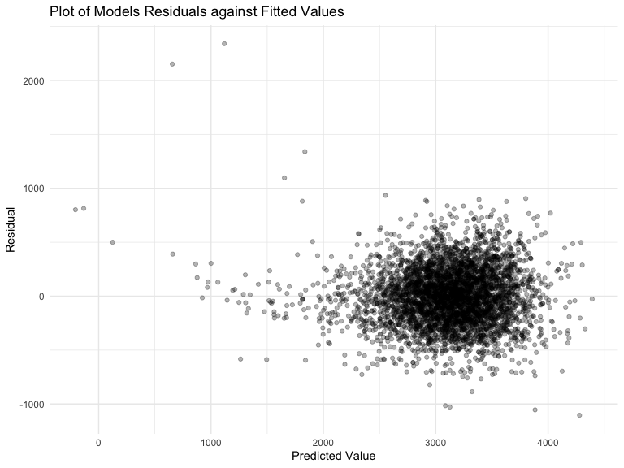
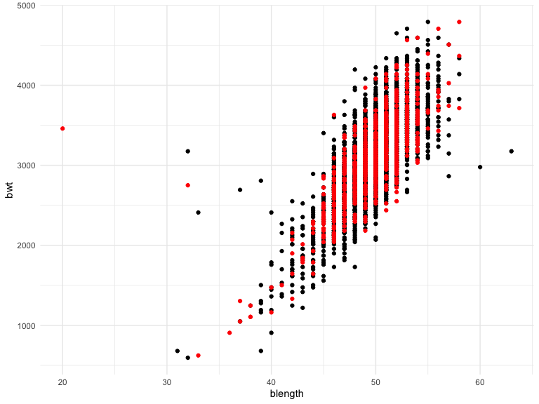
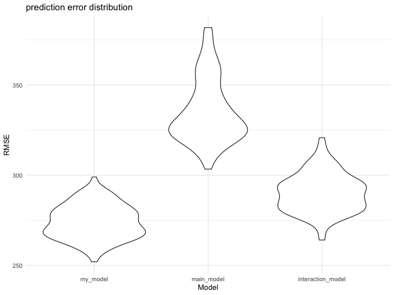

p8105\_hw6\_xf2226
================

# Q1

## Load and clean dataset

``` r
bt_df = 
  read_csv("./data/birthweight.csv") %>% 
  janitor::clean_names() %>% 
  mutate(
    babysex = factor(babysex, levels = c('1', '2'), labels = c("male", "female")),
    malform = factor(malform, levels = c('0', '1'), labels = c("absent", "present")),
    frace = factor(frace, levels = c("1", "2", "3", "4", "8", "9"), labels = c("White", "Black", "Asian", "Puerto Rican", "Other", "Unknown")),
    mrace = factor(mrace, levels = c("1", "2", "3", "4", "8", "9"), labels = c("White", "Black", "Asian", "Puerto Rican", "Other", "Unknown")))
```

Based on a literature for the factors that underly birthweight, we might
include:

-   babysex: baby’s sex - male babies are usually heavier
-   blength: baby’s length at birth (centimeters) - taller baby may be
    heavier just because their height
-   bhead: baby’s head circumference at birth (centimeters) - babies
    with bigger head circumference may be heavier too
-   momage: mother’s age at delivery (years) - younger mother may be
    able to give birth to heathier and heavier babied compared to mother
    over age 35.
-   gaweeks: gestational age in weeks - babies with longer gestational
    age may be heavier and heathier.

``` r
my_model = lm(bwt ~ babysex + gaweeks + blength + bhead + momage, data = bt_df) 
summary(my_model)
```

    ## 
    ## Call:
    ## lm(formula = bwt ~ babysex + gaweeks + blength + bhead + momage, 
    ##     data = bt_df)
    ## 
    ## Residuals:
    ##     Min      1Q  Median      3Q     Max 
    ## -1131.8  -189.9   -11.3   176.7  2604.0 
    ## 
    ## Coefficients:
    ##               Estimate Std. Error t value Pr(>|t|)    
    ## (Intercept)   -6326.11      98.30  -64.35  < 2e-16 ***
    ## babysexfemale    34.67       8.82    3.93  8.5e-05 ***
    ## gaweeks          13.43       1.51    8.87  < 2e-16 ***
    ## blength          81.73       2.07   39.40  < 2e-16 ***
    ## bhead           139.89       3.56   39.30  < 2e-16 ***
    ## momage            5.93       1.13    5.27  1.4e-07 ***
    ## ---
    ## Signif. codes:  0 '***' 0.001 '**' 0.01 '*' 0.05 '.' 0.1 ' ' 1
    ## 
    ## Residual standard error: 285 on 4336 degrees of freedom
    ## Multiple R-squared:  0.691,  Adjusted R-squared:  0.691 
    ## F-statistic: 1.94e+03 on 5 and 4336 DF,  p-value: <2e-16

All variables are significant. I will likely keep all variables in my
final model.

Based on a data-driven model-building process

``` r
full.model <- lm(bwt  ~., data = bt_df)
step.model <- stepAIC(full.model, direction = "backward", 
                      trace = FALSE)
summary(step.model)
```

    ## 
    ## Call:
    ## lm(formula = bwt ~ babysex + bhead + blength + delwt + fincome + 
    ##     gaweeks + mheight + mrace + parity + ppwt + smoken, data = bt_df)
    ## 
    ## Residuals:
    ##     Min      1Q  Median      3Q     Max 
    ## -1097.2  -185.5    -3.4   174.1  2353.4 
    ## 
    ## Coefficients:
    ##                    Estimate Std. Error t value Pr(>|t|)    
    ## (Intercept)       -6098.822    137.546  -44.34  < 2e-16 ***
    ## babysexfemale        28.558      8.455    3.38  0.00074 ***
    ## bhead               130.777      3.447   37.94  < 2e-16 ***
    ## blength              74.947      2.019   37.12  < 2e-16 ***
    ## delwt                 4.107      0.392   10.47  < 2e-16 ***
    ## fincome               0.318      0.175    1.82  0.06884 .  
    ## gaweeks              11.592      1.462    7.93  2.8e-15 ***
    ## mheight               6.594      1.785    3.69  0.00022 ***
    ## mraceBlack         -138.792      9.907  -14.01  < 2e-16 ***
    ## mraceAsian          -74.887     42.315   -1.77  0.07684 .  
    ## mracePuerto Rican  -100.678     19.325   -5.21  2.0e-07 ***
    ## parity               96.305     40.336    2.39  0.01700 *  
    ## ppwt                 -2.676      0.427   -6.26  4.2e-10 ***
    ## smoken               -4.843      0.586   -8.27  < 2e-16 ***
    ## ---
    ## Signif. codes:  0 '***' 0.001 '**' 0.01 '*' 0.05 '.' 0.1 ' ' 1
    ## 
    ## Residual standard error: 272 on 4328 degrees of freedom
    ## Multiple R-squared:  0.718,  Adjusted R-squared:  0.717 
    ## F-statistic:  848 on 13 and 4328 DF,  p-value: <2e-16

The significant predictors are babysex, bhead, blength, delwt, parity,
mheight, mrace, ppwt, and smoken. A lot of these variable are also in
the hypothesized structure driven model

``` r
my_model = lm(bwt ~ babysex + bhead + blength + delwt + momage + parity + gaweeks + mheight + mrace + ppwt + smoken, data = bt_df)
```

## Plotting the final model

``` r
bt_df %>% 
  add_predictions(my_model) %>% 
  add_residuals(my_model) %>% 
  ggplot(aes(x = pred, y = resid)) + 
  geom_point(alpha = .3) +
    labs(
    title = "Plot of Models Residuals against Fitted Values",
    x = "Predicted Value",
    y = "Residual"
  )
```

<!-- -->

## Compared models

Compare my model to 1) a model using length at birth and gestational age
as predictors 2) a model using head circumference, length, sex and all
interactions between these.

``` r
main_model = lm(bwt ~ blength + gaweeks, data = bt_df)
interaction_model = lm(bwt ~ bhead * babysex * blength, data = bt_df) 
```

We will use 80% of the data for our training and 20% for our testing.

``` r
bt_df = bt_df %>%
  mutate(ID = row_number())
train_df = sample_n(bt_df, 3474)
test_df = anti_join(bt_df, train_df, by = "ID")
```

Let’s compare the distributions of the training and testing datasets
using bwt and blength.

``` r
ggplot(train_df, aes(x = blength, y = bwt)) + 
  geom_point() + 
  geom_point(data = test_df, colour = "red")
```

<!-- -->

The distributions seems quite similar.

Fit each of three models to the training data.

``` r
my_model = lm(bwt ~ babysex + bhead + blength + delwt + fincome + 
    gaweeks + mheight + mrace + parity + ppwt + smoken, data = train_df)
model1 = lm(bwt ~ blength + gaweeks, data = train_df)
model2 = lm(bwt ~ bhead + blength + babysex + bhead:blength + bhead:babysex + blength:babysex + bhead:blength:babysex, data = train_df)
```

## Compute and compare root mean squared errors (RMSEs).

``` r
rmse(my_model, test_df)
```

    ## [1] 277

``` r
rmse(model1, test_df)
```

    ## [1] 355

``` r
rmse(model2, test_df)
```

    ## [1] 292

The RMSEs suggest that my\_model works the best.

## Final model comparison with more training sets

``` r
cv_df = 
  crossv_mc(bt_df, 100) #create 100 training sets. 
cv_df = 
  cv_df %>% 
  mutate(
    my_model  = map(.x = train, ~lm(bwt ~ babysex + bhead + blength + delwt + fincome + 
    gaweeks + mheight + mrace + parity + ppwt + smoken, data = .x))
    ) %>% 
  mutate(
    rmse_my_model = map2_dbl(my_model, test, ~rmse(model = .x, data = .y))
    )
cv_df = 
  cv_df %>% 
  mutate(
    main_model = map(.x = train, ~lm(bwt ~ blength + gaweeks, data = .x))
    ) %>% 
  mutate(
    rmse_main_model = map2_dbl(main_model, test, ~rmse(model = .x, data = .y))
    )
cv_df = 
  cv_df %>% 
  mutate(
    interaction_model = map(.x = train, ~lm(bwt ~ bhead * babysex * blength, data = .x))
    ) %>% 
  mutate(
    rmse_interaction_model = map2_dbl(interaction_model, test, ~rmse(model = .x, data = .y))
    )
```

## Prediction error distribution

``` r
cv_df %>% 
  dplyr::select(starts_with("rmse")) %>% 
  pivot_longer(
    everything(),
    names_to = "model", 
    values_to = "rmse",
    names_prefix = "rmse_") %>% 
  mutate(model = fct_inorder(model)) %>% 
  ggplot(aes(x = model, y = rmse)) + geom_violin() + labs(
    x = "Model",
    y = "RMSE", 
    title = "prediction error distribution"
  )
```

<!-- -->

According on the graphs, it appears that my model is the best, the
second best is main model, then interaction model.

# Question 2

## Load weather Data

``` r
weather_df = 
  rnoaa::meteo_pull_monitors(
    c("USW00094728"),
    var = c("PRCP", "TMIN", "TMAX"), 
    date_min = "2017-01-01",
    date_max = "2017-12-31") %>%
  mutate(
    name = recode(id, USW00094728 = "CentralPark_NY"),
    tmin = tmin / 10,
    tmax = tmax / 10) %>%
  dplyr::select(name, id, everything())
```
